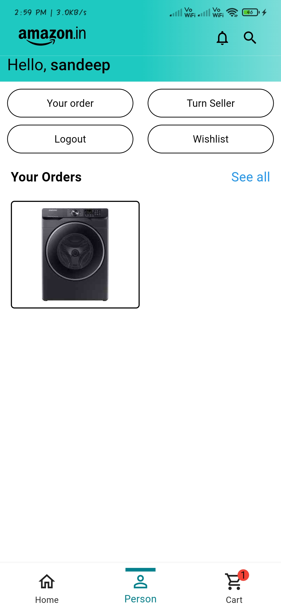
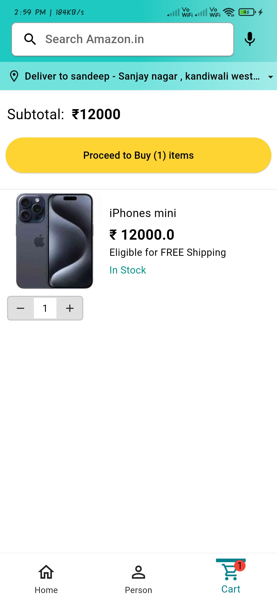
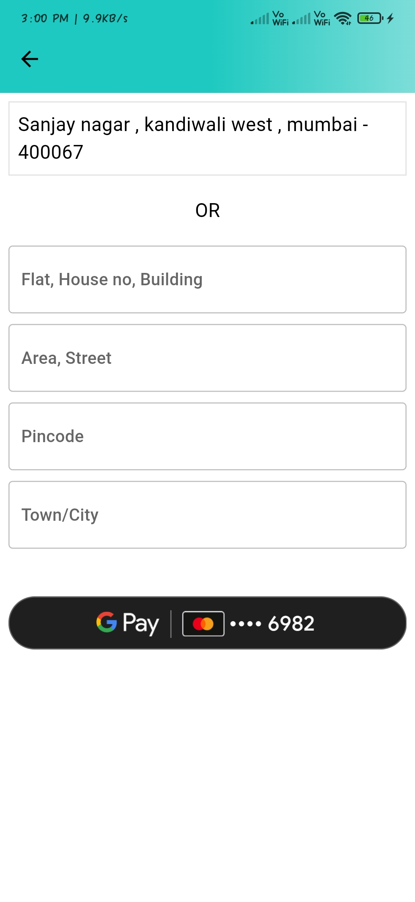
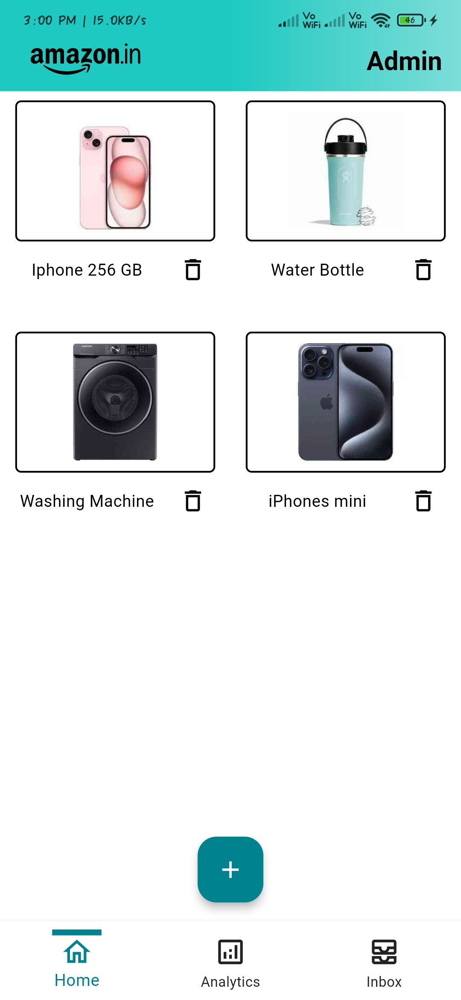
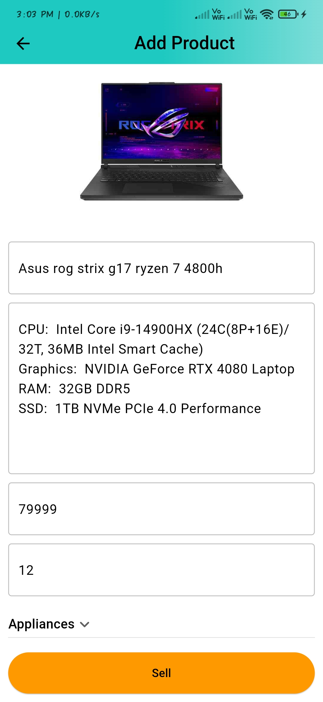
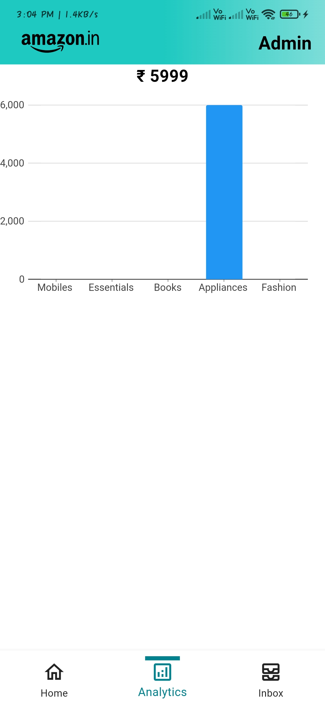
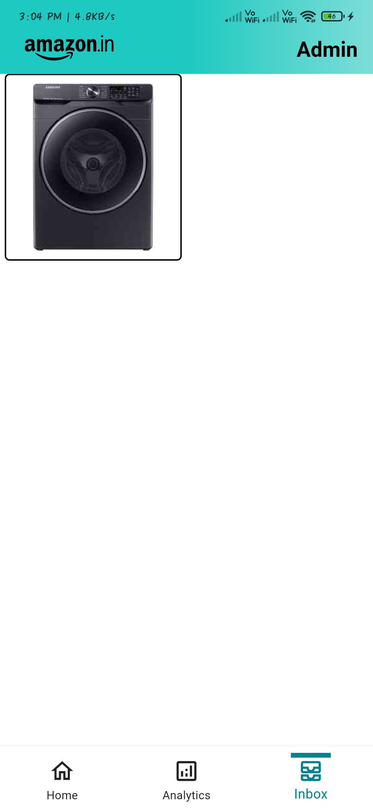

# Amazon Clone in flutter Mobile app

### User side Overview

### Admin side Overview

#### Tools use

- [Flutter](https://flutter.dev/)
- [Dart](https://dart.dev/)
- [Git](https://git-scm.com/)
- [Node.js](https://nodejs.org/en/)
- [MongoDB](https://www.mongodb.com/)
- [Cloudnary](https://cloudinary.com/)
- [Heroku](https://www.heroku.com/)
- [Pub Dev](https://pub.dev/)

#### Node packages

- **bcryptjs**: ^2.4.3
- **express**: ^4.18.2
- **http**: ^0.0.1-security
- **jsonwebtoken**: ^9.0.2
- **mongoose**: ^8.0.0

#### Flutter Dependencies

- **cupertino_icons**: ^1.0.2
- **http**: ^1.1.0
- **provider**: ^6.0.5
- **shared_preferences**: ^2.2.2
- **badges**: ^3.1.2
- **carousel_slider**: ^4.2.1
- **dotted_border**: ^2.1.0
- **file_picker**: ^8.0.0+1
- **cloudinary_public**: ^0.23.1
- **flutter_rating_bar**: ^4.0.1
- **pay**: ^2.0.0
- **charts_flutter_new**: ^0.12.0

